# Semi-Automated Filling and Sealing Machine

An industrial automation project developed using Siemens S7-1200 PLC, Siemens SIMATIC HMI, pneumatic actuators, sensors, and conveyor-based material handling systems.

## Project Overview

The Semi-Automated Filling and Sealing Machine was developed to automate the cup dispensing, liquid filling, cup relocation, and sealing process. The machine combines PLC control, HMI operation, pneumatic systems, sensors, and conveyor mechanisms to improve productivity and reduce manual intervention.

### Objectives

- Automate the cup dispensing process
- Fill approximately 350 ml of liquid into each cup
- Relocate filled cups to the sealing station automatically
- Complete the filling and sealing process within 2 minutes
- Improve process consistency and reduce operator workload

---

# Mechanical Design

## 3D CAD Model

The machine was first designed and simulated using CAD software before fabrication and assembly.

### Isometric View

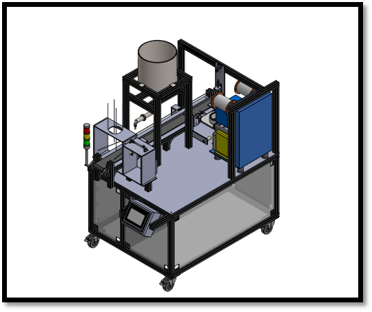

*Figure 1. Isometric CAD model of the Semi-Automated Filling and Sealing Machine.*

### Front View

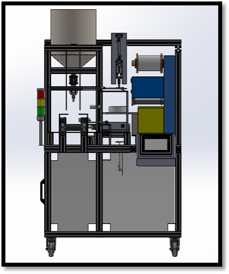

*Figure 2. Front view of the machine showing dispensing, filling, relocating, and sealing stations.*

### Top View

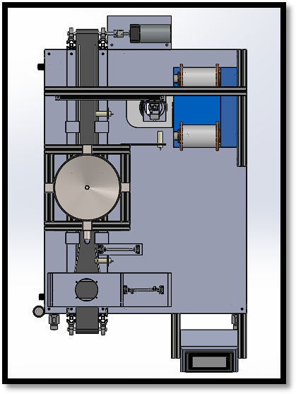

*Figure 3. Top view illustrating the machine layout and station arrangement.*

---

# System Architecture

## Process Flow

The overall system architecture consists of a Siemens PLC, HMI, sensors, and pneumatic actuators that coordinate the dispensing, filling, relocation, and sealing operations.

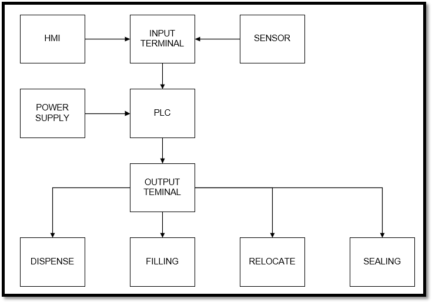

*Figure 4. System architecture and control flow.*

---

# Control System Development

## 1. Sequential State Machine Control

The machine sequence was designed using GRAFCET methodology to coordinate dispensing, filling, relocation, and sealing operations in a structured state-based control system.

**Skills demonstrated:**
- Sequential State Machine Control
- Automatic Production Mode
- Industrial Process Sequencing

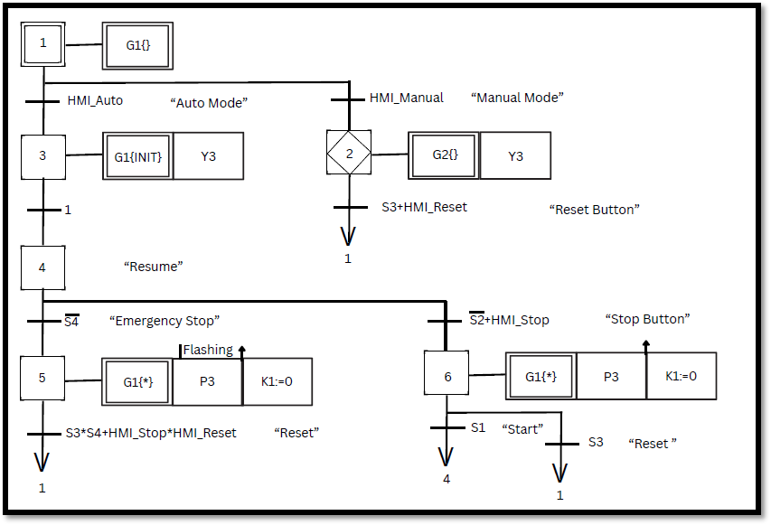

*Figure X. Main GRAFCET sequence used to coordinate the complete machine operation.*

---

## 2. Machine Control & Safety Logic

The PLC program incorporates machine start, stop, reset, and safety handling functions to ensure reliable and safe operation under different operating conditions.

**Skills demonstrated:**
- Start / Stop / Reset Functions
- Emergency Stop Handling
- Fault Recovery Logic
- HMI Integration

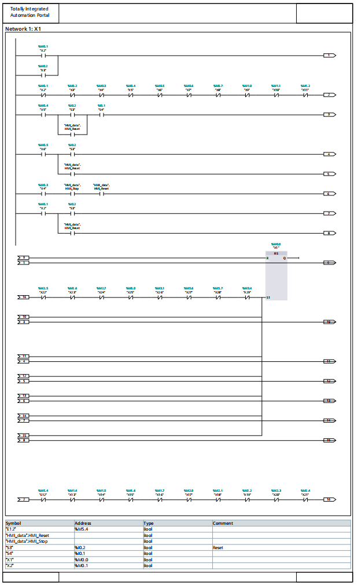

*Figure X. Ladder logic implementing machine initialization, state transitions, reset handling, and HMI interaction.*

---

## 3. Sensor-Based Decision Making

The control system utilizes sensor feedback to validate process conditions before allowing machine state transitions. This ensures reliable operation and prevents incorrect process execution.

**Skills demonstrated:**
- Sensor Feedback Verification
- Automatic Sequence Triggering
- Process Validation Logic

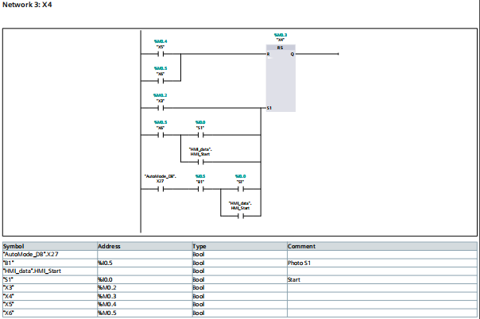

*Figure X. Ladder logic utilizing sensor feedback and machine state verification for automatic sequence control.*

---

## 4. Manual Maintenance & Pneumatic Control

A dedicated maintenance interface was developed using Siemens SIMATIC HMI to allow individual testing and troubleshooting of pneumatic actuators during commissioning and maintenance activities.

**Skills demonstrated:**
- Manual Maintenance Mode
- Pneumatic Actuator Control
- HMI Development
- Machine Commissioning

### Manual Mode Overview

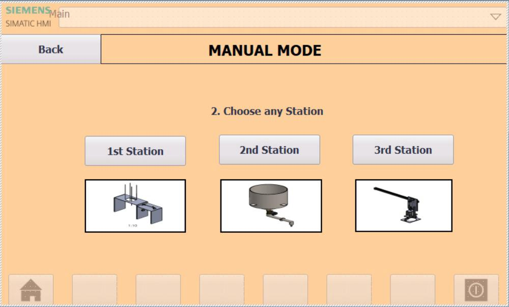

*Figure X. Manual maintenance page used for actuator testing and troubleshooting.*

### Station 1 – Cup Dispensing Control

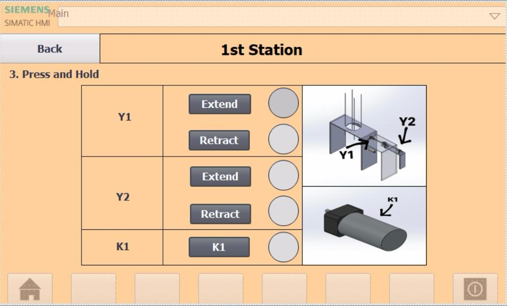

*Figure X. Manual control interface for the cup dispensing mechanism.*

### Station 2 – Filling Station Control

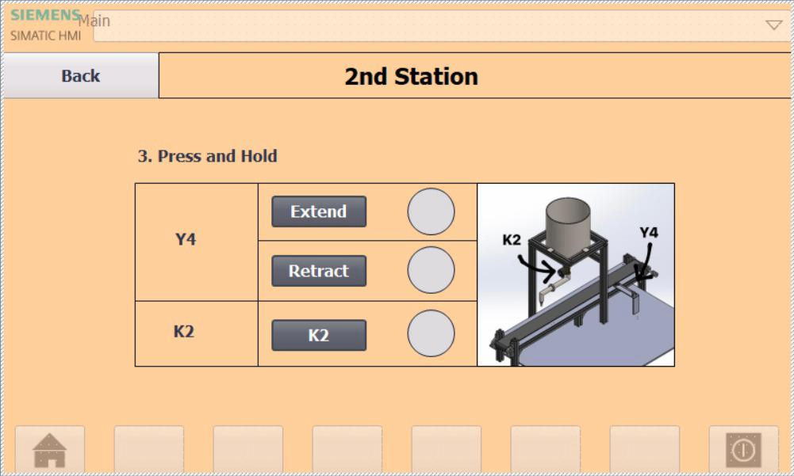

*Figure X. Manual control interface for the filling mechanism.*

### Station 3 – Relocation System Control

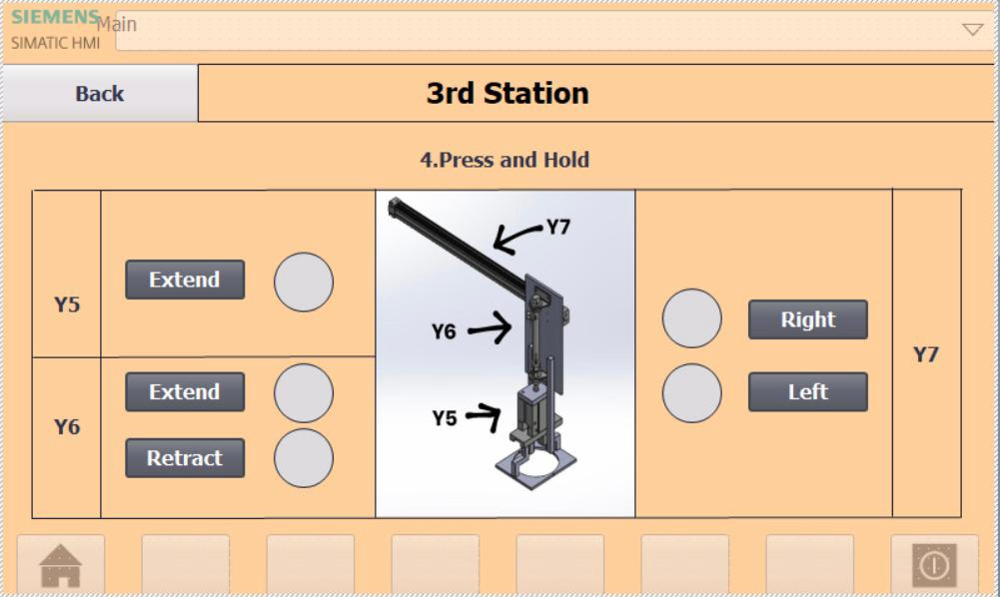

*Figure X. Manual control interface for the pick-and-place relocation mechanism.*

---

# Machine Implementation

## Final Prototype

The fabricated machine integrates the dispensing station, filling system, conveyor mechanism, relocation system, sealing station, PLC panel, and HMI control interface.

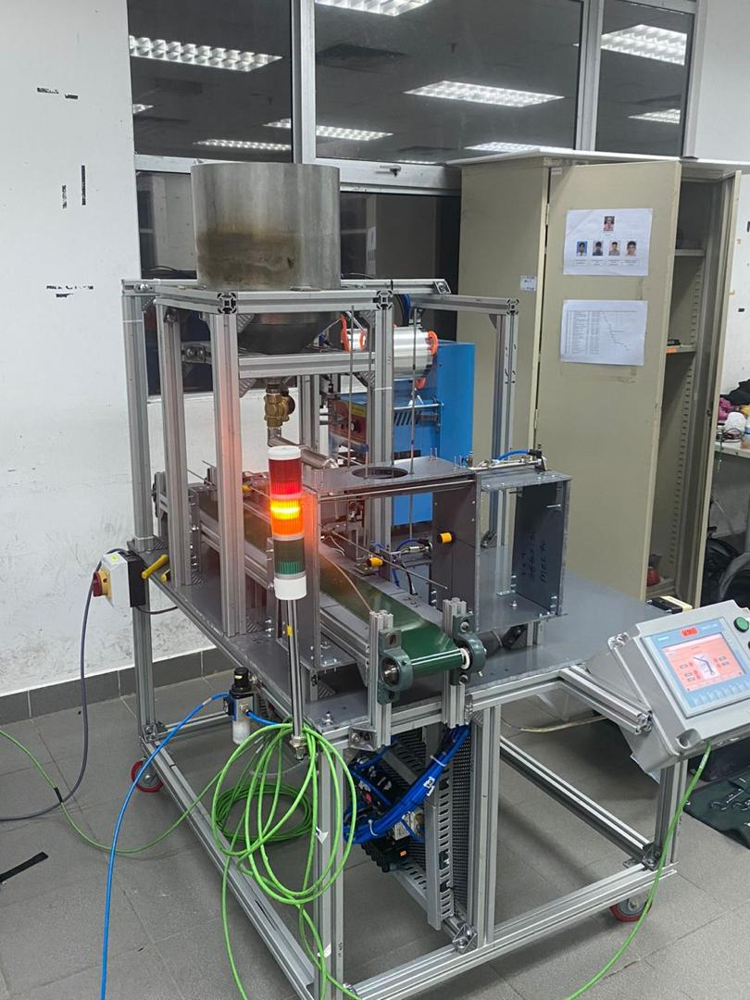

*Figure 19. Fully assembled machine prototype.*

## Station 1 – Cup Dispensing

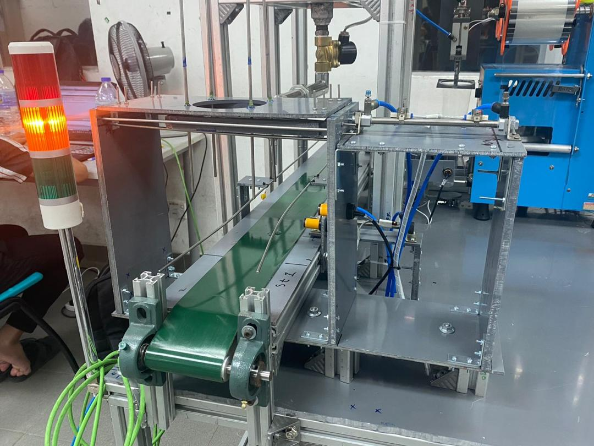

*Figure 20. Cup dispensing station responsible for releasing cups onto the conveyor.*

## Station 2 – Filling Station

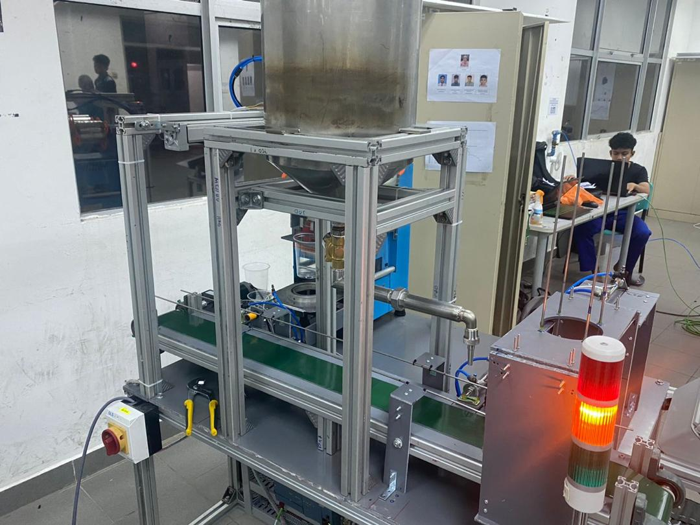

*Figure 21. Filling station used to dispense liquid into each cup.*

## Station 3 – Relocation and Sealing

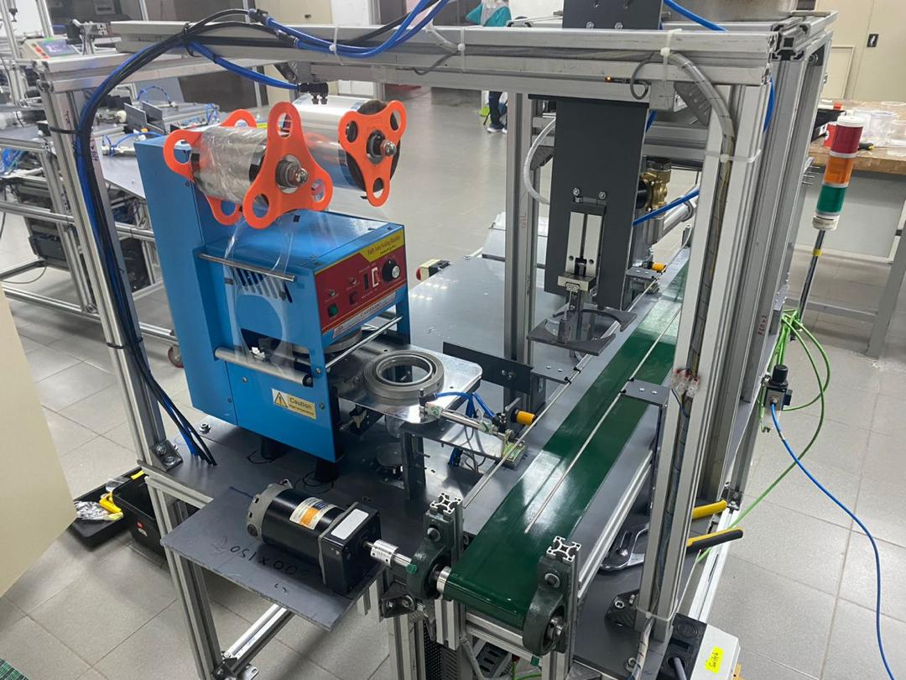

*Figure 22. Pick-and-place mechanism used to transfer cups to the sealing station.*

---

# Electrical Integration

The machine integrates industrial electrical wiring, PLC I/O connections, sensor interfaces, power distribution, and pneumatic actuator control to ensure reliable machine operation.

## PLC Control Panel

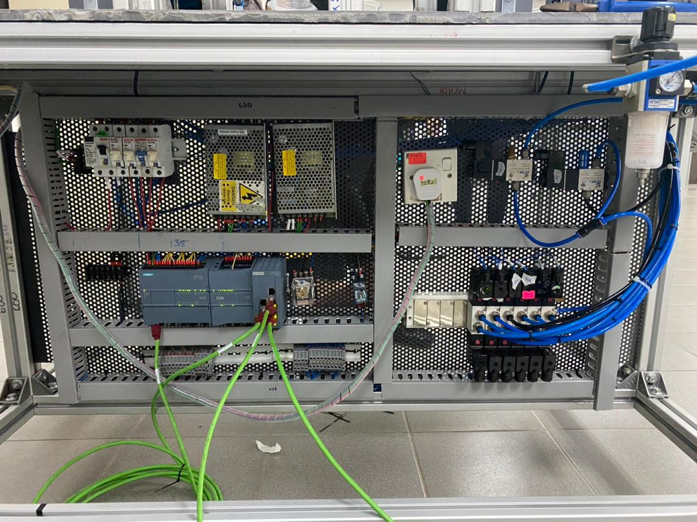

*Figure X. Electrical control panel containing the Siemens S7-1200 PLC, power supply units, relay modules, terminal blocks, and pneumatic control components.*

### Main Components

- Siemens S7-1200 PLC
- 24VDC Power Supply
- Relay Modules
- Terminal Blocks
- Pneumatic Solenoid Valves
- Industrial Ethernet Communication

---

## PLC Wiring Diagram

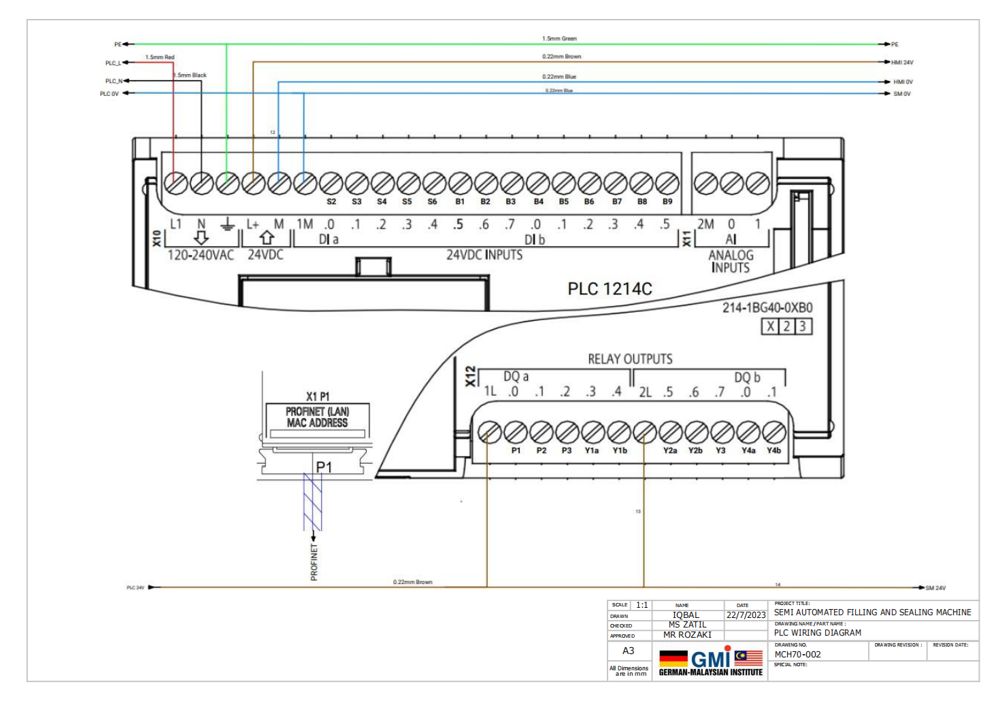

*Figure X. PLC wiring diagram showing the connection between controller inputs, outputs, sensors, and machine actuators.*

**Skills demonstrated:**
- PLC I/O Integration
- Industrial Electrical Wiring
- Sensor Interface Design
- Control System Integration

---

## Pneumatic Wiring Diagram

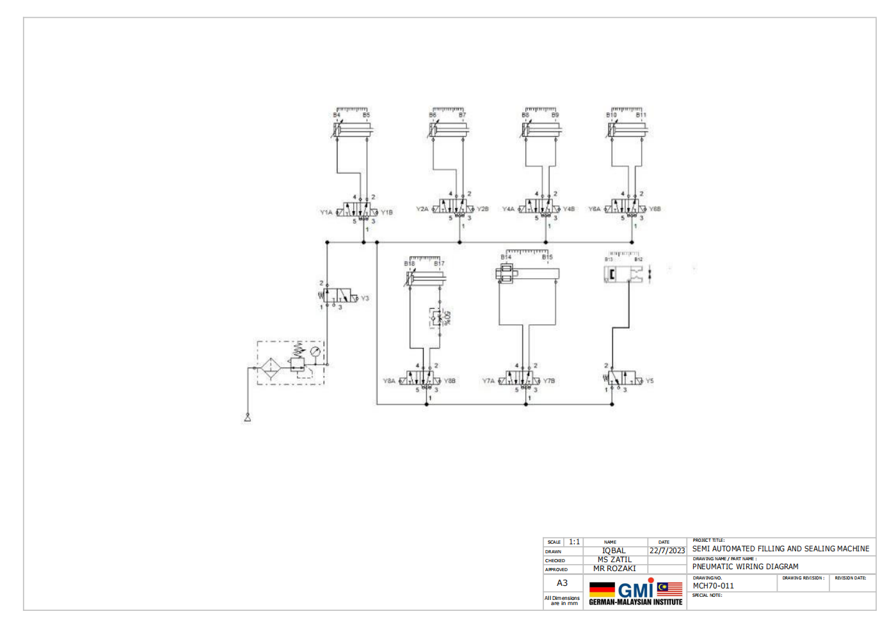

*Figure X. Pneumatic circuit used to control the dispensing, filling, relocation, and sealing actuators.*

**Skills demonstrated:**
- Pneumatic System Design
- Solenoid Valve Integration
- Cylinder Control
- Electro-Pneumatic Automation

---

# Tools & Technologies

- Siemens S7-1200 PLC
- Siemens SIMATIC HMI
- Ladder Logic Programming
- GRAFCET Methodology
- Pneumatic Systems
- Conveyor Systems
- Industrial Sensors
- Industrial Automation
- Electrical Wiring
- Mechanical Design

---

# Engineering Competencies

- Siemens TIA Portal Development
- PLC Programming (LAD)
- GRAFCET Design
- HMI Development
- Pneumatic System Integration
- Industrial Automation
- Electrical Control Panel Wiring
- PLC I/O Integration
- Machine Commissioning
- Troubleshooting & Debugging

---

# Demonstration Video

The following video demonstrates the completed machine prototype operating in automatic mode, including cup dispensing, liquid filling, cup relocation, and sealing operations.

▶️ **FYP Diploma: Semi-Automated Filling and Sealing Machine**

https://youtu.be/4RgV-Rcvqg0

---

# Project Team

This project was developed collaboratively as part of an academic engineering project.

## Authors

- Muhammad Iqbal Bin Izan
- Muhammad Luqman Hakim Bin Abdul Razak
- Darwish 
- Fadhlulhaq

## Academic Information

Bachelor of Mechatronic Engineering with Honours

Universiti Malaysia Perlis (UniMAP)

---

## Note

This repository is intended to showcase the project architecture, implementation, and outcomes. Some supporting files used during development are not included.
