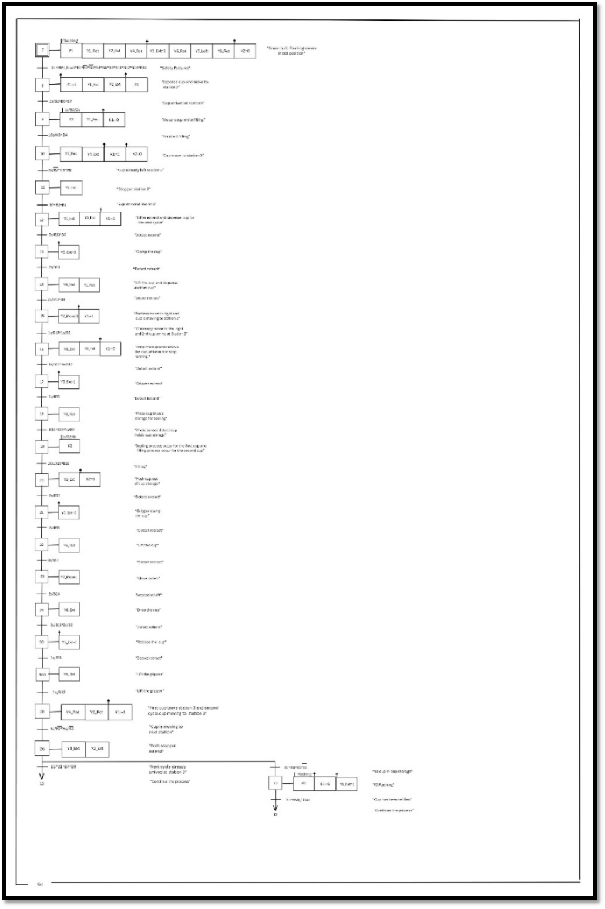
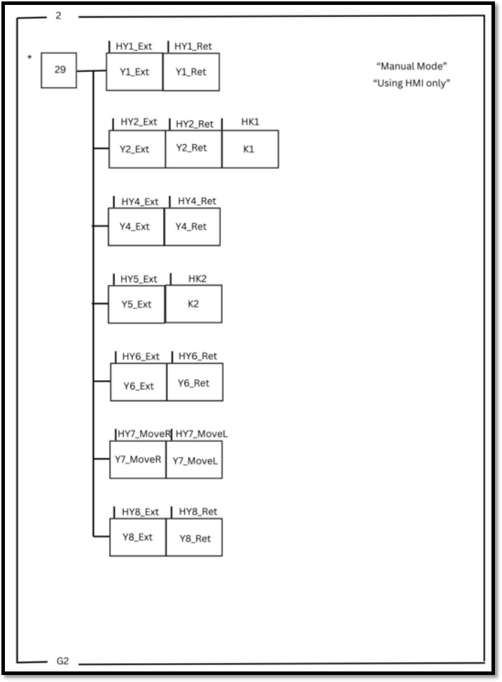
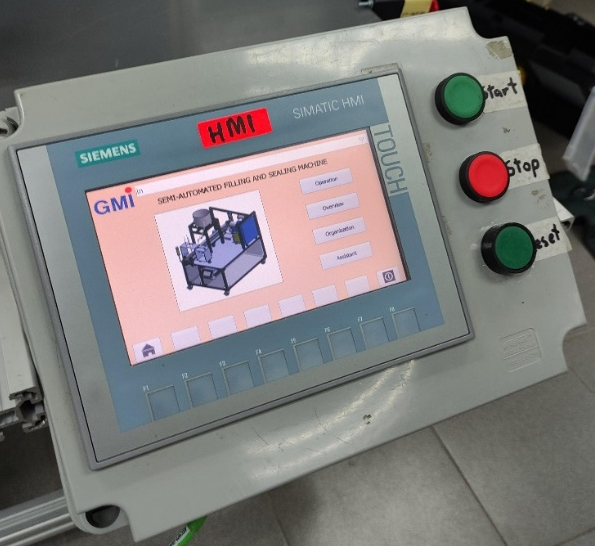
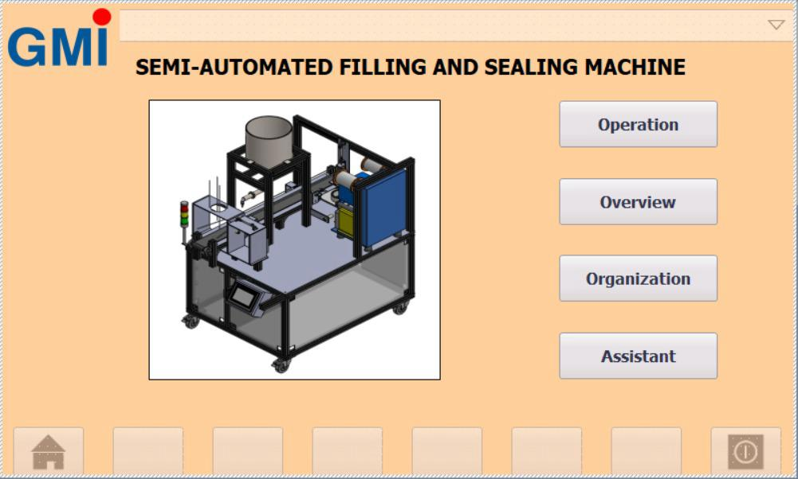
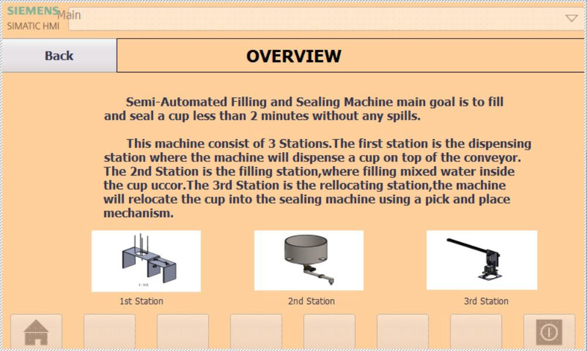
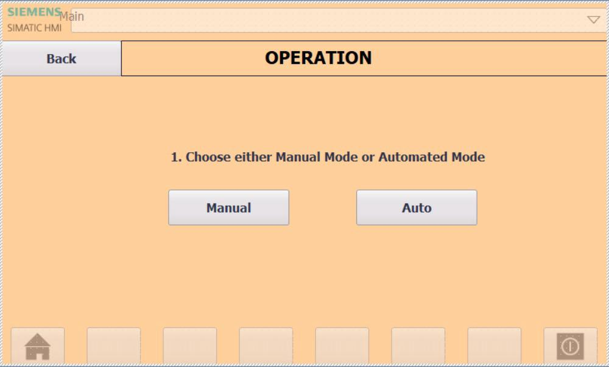
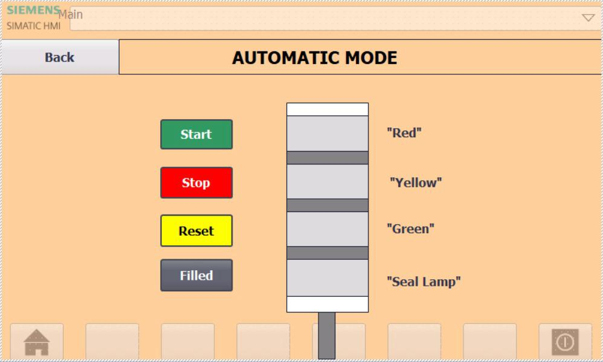
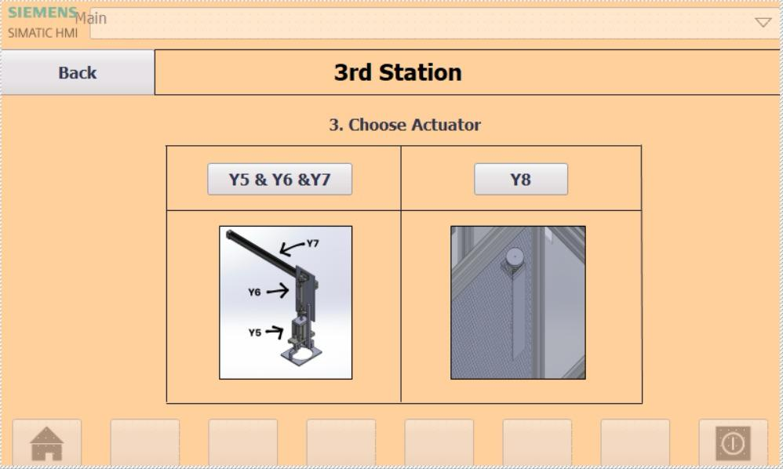
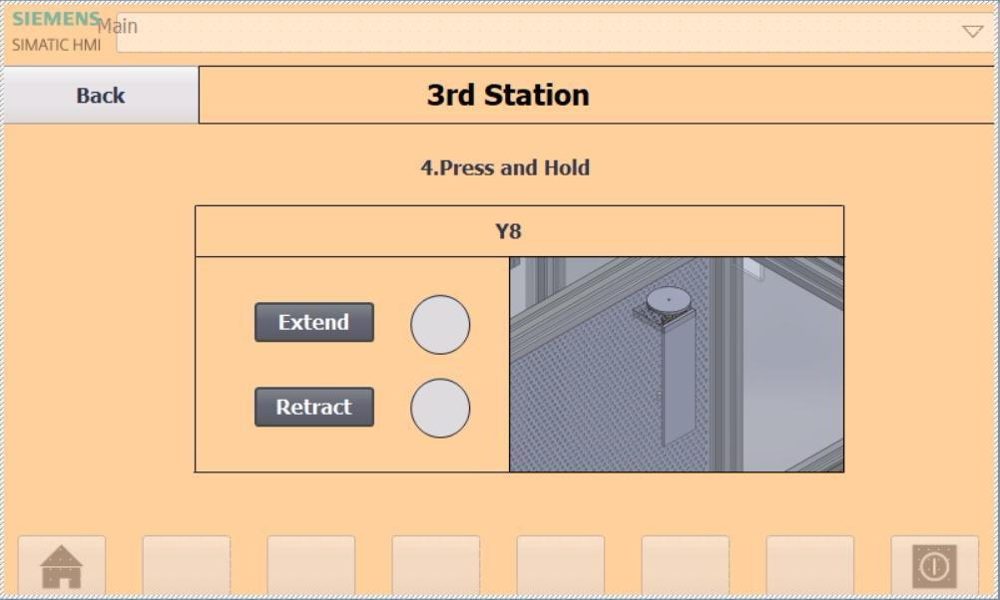

# Semi-Automated Filling and Sealing Machine

An industrial automation project developed using Siemens S7-1200 PLC, Siemens SIMATIC HMI, pneumatic actuators, sensors, and conveyor-based material handling systems.

## Project Overview

The Semi-Automated Filling and Sealing Machine was developed to automate the cup dispensing, liquid filling, cup relocation, and sealing process. The machine combines PLC control, HMI operation, pneumatic systems, sensors, and conveyor mechanisms to improve productivity and reduce manual intervention.

### Objectives

- Automate the cup dispensing process
- Fill approximately 350 ml of liquid into each cup
- Relocate filled cups to the sealing station automatically
- Complete the filling and sealing process within 2 minutes
- Improve process consistency and reduce operator workload

---

# Project Design

## 3D CAD Model

The machine was first designed and simulated using CAD software before fabrication and assembly.

### Isometric View

*Figure 1. Isometric CAD model of the Semi-Automated Filling and Sealing Machine.*

### Front View

*Figure 2. Front view of the machine showing dispensing, filling, relocating, and sealing stations.*

### Top View

*Figure 3. Top view illustrating the machine layout and station arrangement.*

---

# System Architecture

## Process Flow

The overall system architecture consists of a Siemens PLC, HMI, sensors, and pneumatic actuators that coordinate the dispensing, filling, relocation, and sealing operations.

*Figure 4. System architecture and control flow.*

---

# PLC Control Logic

The machine control sequence was developed using the GRAFCET methodology to ensure structured and reliable operation.

## Main GRAFCET

*Figure 5. Main control sequence governing machine startup, operation mode selection, and system control.*

## Automatic Mode GRAFCET

*Figure 6. Automatic operating sequence controlling the complete filling and sealing cycle.*

## Manual Mode GRAFCET

*Figure 7. Manual control sequence used for testing, troubleshooting, and maintenance purposes.*

---

# Human Machine Interface (HMI)

A Siemens SIMATIC HMI was developed to provide user-friendly machine control and monitoring functions.

## Physical HMI Panel

*Figure 8. Siemens SIMATIC HMI integrated with physical control buttons.*

## Main Menu

*Figure 9. Main navigation page of the HMI.*

## System Overview Page

*Figure 10. Overview page explaining machine operation and station functions.*

## Operation Selection

*Figure 11. Selection page for Manual Mode and Automatic Mode.*

## Automatic Mode

*Figure 12. Automatic operation screen used to control the production cycle.*

## Manual Mode

*Figure 13. Manual operation page for actuator testing and maintenance.*

## Station 1 – Dispensing System

*Figure 14. Manual controls for the dispensing station.*

## Station 2 – Filling System

*Figure 15. Manual controls for the filling station.*

## Station 3 – Relocation System

*Figure 16. Manual controls for the pick-and-place relocation system.*

## Station 3 – Actuator Selection

*Figure 17. Selection interface for additional relocation actuators.*

## Station 3 – Y8 Actuator

*Figure 18. Dedicated control page for Y8 actuator operation.*

---

# Machine Implementation

## Final Prototype

The fabricated machine integrates the dispensing station, filling system, conveyor mechanism, relocation system, sealing station, PLC panel, and HMI control interface.

*Figure 19. Fully assembled machine prototype.*

## Station 1 – Cup Dispensing

*Figure 20. Cup dispensing station responsible for releasing cups onto the conveyor.*

## Station 2 – Filling Station

*Figure 21. Filling station used to dispense liquid into each cup.*

## Station 3 – Relocation and Sealing

*Figure 22. Pick-and-place mechanism used to transfer cups to the sealing station.*

---

# Electrical and Pneumatic Integration

## Control Panel Wiring

The electrical control panel contains the Siemens S7-1200 PLC, power supply units, relays, terminal blocks, communication modules, and pneumatic valve controls.

*Figure 23. Electrical control panel and wiring system.*

---

# Technologies Used

- Siemens S7-1200 PLC
- Siemens SIMATIC HMI
- Ladder Logic Programming
- GRAFCET Methodology
- Pneumatic Systems
- Conveyor Systems
- Industrial Sensors
- Industrial Automation
- Electrical Wiring
- Mechanical Design

---

# Skills Demonstrated

- PLC Programming
- HMI Development
- Industrial Automation
- Pneumatic System Integration
- Machine Design
- Electrical Wiring
- Control Panel Assembly
- System Commissioning
- Troubleshooting
- Technical Documentation

---

# Project Team

This project was developed collaboratively as part of an academic engineering project.

## Authors

- Muhammad Iqbal Bin Izan
- Muhammad Luqman Hakim Bin Abdul Razak
- Darwish 
- Fadhlulhaq

## Academic Information

Bachelor of Mechatronic Engineering with Honours

Universiti Malaysia Perlis (UniMAP)

---

## Note

This repository is intended to showcase the project architecture, implementation, and outcomes. Some supporting files used during development are not included.
